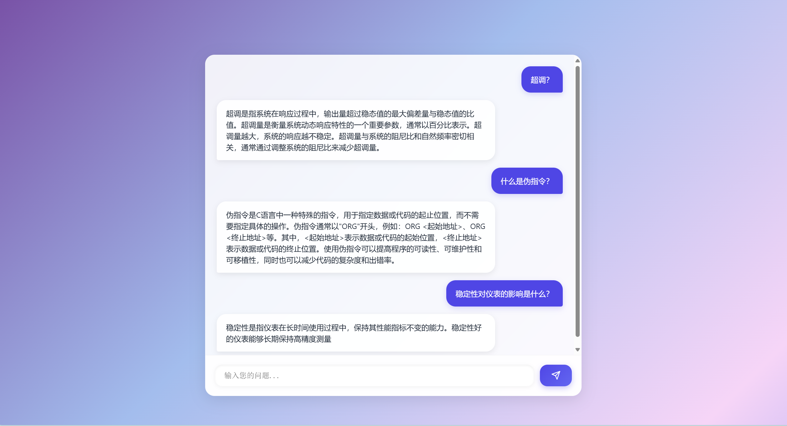
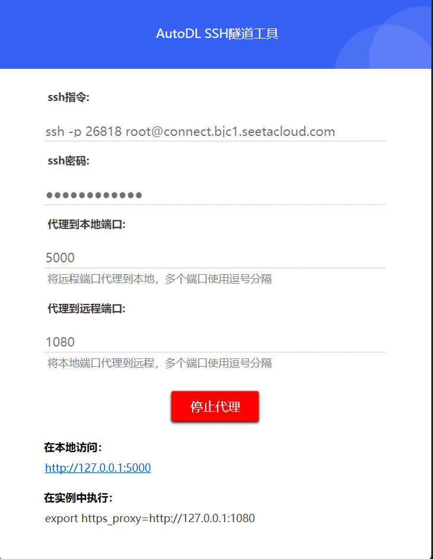

# 项目 README

## 项目概述

在已有代码的基础上进行改进，降低问答对生成过程调用api的成本并提高问答对质量，减少训练过程的手动操作步骤并简化训练集准备流程，添加api调用错误处理机制提高代码鲁棒性，添加代码控制台输出反馈机制提高代码可视性，并且在原有代码只能实现控制台输出基础上添加了网页的交互功能，使代码封装后的使用效果更好且支持远程联网使用而非原本的只能本地运行，降低了运行成本使代码更加适应可能的应用场景

### 主要功能
1. **训练集数据库支持多领域知识**：项目数据库包含自动控制原理、过程控制、现代控制理论、微机原理、中国近现代史、过程参数等专业学科的知识，可应答上述领域的专业问题。
2. **功能封装与网页交互**：本项目封装了原有的代码，并通过网页前端实现了更友好的用户交互。网页部分集成了 Flask 路由，支持用户提交问题并接收模型的回答。
3. **优化训练流程**：通过优化文本训练过程，支持更低成本、更大数据量的训练，并简化了训练集准备工作。


## 部署流程

### 系统要求
- **显存要求**：至少 48GB 显存。
- **存储空间**：至少 20GB 存储空间。
- **依赖项**：
  - Python 3.12
  - Pytorch 2.5.1
  - cuda 12.4
  - 安装 Conda（推荐用于虚拟环境管理）

### 环境配置
1. **部署框架**：使用 AUTODL 部署框架进行部署。
2. **安装依赖**：
   - 在虚拟环境中安装必要的依赖库：
     ```bash
     conda install -c pytorch faiss-gpu
     pip install transformers==4.40.0 tokenizers==0.19.2
     ```
   - 确保使用支持 CUDA 的 Linux 环境。
   
2. **文件传输**：使用 FileZilla 将代码文件传输到远程服务器。具体操作步骤：
   - 打开 FileZilla。
   - 进入 “文件” > “站点管理” > “远程传输”。
   - 将 `chat.py` 和相应的 glm 框架部署到服务器上的指定目录，确保框架文件与 `chat.py` 在同一目录下。

3. **修改代码路径**：确保在代码中正确指定服务器上的模型路径。根据具体部署路径修改代码中的地址：
   ```python
   # 修改路径至服务器上的路径
   # /tmp/pycharm_project_项目id/chatglm/chatglm2/model
## 配置 SSH 连接与部署流程

### 1. 配置 SSH 连接
- **通过 PyCharm 配置 SSH 通道**：
  - 在 PyCharm 专业版中，通过 SSH 工具配置与远程服务器的连接。
  - 确保配置了正确的解释器，使其能够通过 SSH 正确识别并执行远程代码。

### 2. 连接远程服务器
- **建立远程连接**：
  - 使用 PyCharm 专业版的 SSH 功能连接到远程服务器。
  - 在远程服务器上确保已经安装好所需的依赖项，并配置好解释器。

### 3. 安装依赖
- **安装 Faiss GPU 支持**：
  - 在远程服务器环境中，安装 Faiss GPU 支持，执行以下命令：
    ```bash
    conda install -c pytorch faiss-gpu
    ```
  - 确保服务器环境支持 CUDA，且操作系统为 Linux，以确保 Faiss 能正确安装。

### 4. 公网域名配置
- **关于公网域名**：
  - 由于成本原因，本项目没有配置公网域名。
  - 如果需要进行远程访问，可以使用 AUTODL 提供的 SSH 工具进行访问，而无需配置公网域名。

### 5. 模型推理环境
- **使用 GPU 环境**：
  - 如果服务器支持 GPU 运算，确保 CUDA 环境已正确配置，以支持模型推理。
  
- **使用 CPU 环境**：
  - 如果服务器不支持 GPU，可以调整模型运行配置，将其设置为 CPU 模式。
  - 需要修改相关代码，将模型推理改为运行在 CPU 上：
    ```python
    model.to('cpu')
    ```

### 6. 注意事项
- **文件传输**：
  - 确保所有文件已经正确传输到远程服务器，包括模型文件和代码文件。
  
- **路径修改**：
  - 在远程服务器上修改代码中的路径，确保正确引用存储位置：
    ```python
    # 修改路径至服务器上的路径
    # /tmp/pycharm_project_项目id/chatglm/chatglm2/model
    ```

- **模型加载测试**：
  - 在远程服务器上完成路径修改后，测试是否能够成功加载模型，并执行推理任务。
  
- **保持稳定的远程连接**：
  - 在部署过程中，保持远程连接稳定，确保所有依赖项和配置都能够顺利安装并运行。
：

## 常见问题
 

### 1. Faiss 配置失败
- **问题描述**：在安装 `faiss-gpu` 时，出现配置失败。
- **解决方案**：需要配置 NVIDIA 的 CUDA 环境，并且操作系统必须是 Linux。请确保正确配置了 GPU 环境并安装了必要的驱动。

```bash
conda install -c pytorch faiss-gpu
```

### 2. Transformers 和 Tokenizers 版本要求
**问题描述**：transformers 和 tokenizers 的版本不匹配。

**解决方案**：
- transformers 必须是 4.40.0 版本及以下
- tokenizers 必须是 0.19.2 版本及以下

安装命令：
```bash
pip install transformers==4.40.0
```

### 3. Query 处理与模型调用问题本项目的解决思路比较不符合常理，手动添加打印模型具体信息的代码
**问题描述**：模型调用方式复杂，需手动添加调试信息。

#### 解决方案：
首先，运行以下代码，查看模型的调用方式：

```python
from inspect import signature
print(signature(chat_model.chat))
```
打印出来的结果应类似于：

```python
(tokenizer, session_meta: transformers_modules.model.characterglm_generation_utils.SessionMeta, query: str, history: List[Tuple[str, str]] = None, max_length: int = 8192, num_beams=1, do_sample=True, top_p=0.9, temperature=0.9, repetition_penalty=1.6, logits_processor=None, **kwargs)
```
可以看到中间多了个 transformers_modules.model.characterglm_generation_utils.SessionMeta，这就是 session_meta 参数。
为了解决这个问题，手动导入 SessionMeta：

```python
from characterglm_generation_utils import SessionMeta
```
然后手动把 site 文件拖拽过来。
最终，调用代码格式必须为：
```python
chat_model.chat(
    chat_tokenizer,
    session_meta,
    query + "。改写上述话",
    history=[],
    do_sample=True,
    num_beams=3,
    temperature=2.0
)  # 必须是这个顺序
```

### 4. 解决控制台输出冗余信息的问题

#### 问题描述：
上述问题的解决方法会导致控制台输出多余的问答过程信息。为了避免不必要的输出，可以通过禁用警告信息并重定向标准输出和错误输出到 null 设备来实现静默输出。

#### 解决方案：
首先，在 `characterglm` 中加入以下代码来禁用警告信息：

```python
import warnings
import sys
import os

# 禁用所有警告信息
warnings.filterwarnings("ignore")

# 重定向标准输出和错误输出到 null 设备（完全静默）
sys.stdout = open(os.devnull, 'w')
sys.stderr = open(os.devnull, 'w')
```
然后，为了能够控制何时打印输出，可以使用“夹心结构”来恢复和禁止输出。具体步骤如下：

```python

# 恢复输出
sys.stdout = sys.__stdout__

# 输入问题
query = input("输入问题: ")

# 禁止输出
sys.stdout = open(os.devnull, 'w')
这样，在需要时可以禁止输出，从而使输出变得干净。然而，调试过程中，不屏蔽输出也有其优势，能够更清晰地了解程序运行的细节。
```

### 5. 网页部分模块化设计和根目录配置

#### 问题描述：
网页部分没有采用严格的模块化设计结构，由于一些现在还没有解决的问题，最终验证只有将html写入chat代码的内嵌式结构才能够保证稳定运行

#### 解决方案：
本项目调试过程中，主要问题在于没有正确配置根目录，导致出现 404 错误。为了解决这个问题，需要添加根目录路由：

```python
@app.route('/')
def index():
    return render_template_string(html_content)
```
主要的内嵌结构模板：
```python
from flask import Flask, request, jsonify, render_template_string
app = Flask(__name__)
# HTML 内容
html_content = '''
前端代码
'''
# 根目录路由
@app.route('/')
def home():
    return render_template_string(html_content)

# 处理用户消息并返回模型响应
@app.route('/send_message', methods=['POST'])
def send_message():
    user_message = request.json.get("user_message")
    # 处理用户消息并获取模型回答
    response = "模型回答"
    return jsonify({'model_response': response})

# 处理favicon.ico请求，避免404错误
@app.route('/favicon.ico')
def favicon():
    return '', 204  # 返回204无内容状态码

if __name__ == '__main__':
    app.run(debug=True)
 ```
解释：
使用 render_template_string 直接嵌入 HTML 内容到 Flask 应用中，确保网页能够正确渲染。
/send_message 路由处理用户输入和模型返回的消息。
/favicon.ico 路由避免浏览器请求 favicon 时出现 404 错误。
启动 Flask 应用时，开启调试模式以便调试。
通过以上配置，可以解决由于根目录缺失导致的 404 错误，并实现稳定运行。

### 6. 转化为 CPU 运行

#### 解决方案：
如果 CPU 足够强大，可以将程序转化为 CPU 运行，主要通过注释掉 `.cuda()` 的调用并添加 `model.to('cpu')`。示例如下：

```python
# 注释掉CUDA调用
# model.cuda()

# 转为CPU运行
model.to('cpu')
```
需要注意的是，问答部分和模型必须同时运行在 CPU 或 GPU 上，确保两者一致。

### 7. 生成问答对时的 JSON 问题

在生成问答对的 `get_qa.py` 时，如果遇到 JSON 问题，通常不是代码的问题。大部分情况下，这与 DeepSeek 的 API 功能问题有关。官网的 API 经常会出现问题。

#### 解决方案：
当遇到此类问题时，不必怀疑代码问题，建议检查 DeepSeek 官方 API 的状态，或者等待其修复,这玩意总出问题。


### 8. 运行 `chat` 时的异常处理

#### 问题描述：
如果在 `prompt = get_prompt(recall_result)` 命令执行时报告异常，需要重新运行以下脚本：

- `bert_rank_model.py`
- `dssm_recall_model.py`
- 使用 `get_index.py` 重新列装

#### 解决方案：
确保以上脚本正确执行并重新初始化模型，解决因模型未正确加载导致的异常问题。


### 9. 问答对初步输出格式

问答对的初步输出必须严格遵循以下格式：
```json
{"content": "....？","summary": "..."}
```
如果格式不符合要求，问题将被遗漏或无法正常处理
格式，否则该问题会被遗漏

### 10. 问题诊断和检查流程

- **若 `get_qa.py` 出现问题**：可以试运行 `test_ds` 进行检查。
- **若 `chat_html.py` 出现问题**：可以运行 `chat`（检查模型）和 `test_glm`（检查 GLM 模型和网页）进行诊断。
- **若 `test_glm` 出现问题**：可以运行 `test_flask`，以确定问题是出在显卡上还是网页部分。

通过这些检查步骤，可以快速定位问题并采取相应措施进行解决。

---

### 11. 代码优化：避免重复条目

```python
# 直接添加所有条目，不再检查重复
all_entries.extend(entries)
```
替换为：

```python
seen = set()
for entry in entries:
    content = entry.get("content", "")
    if content and content not in seen:
        seen.add(content)
        all_entries.append(entry)
```
此外，取消注释 get_train_set.py 中的以下代码：

```python
# value_list = list(set(value_list))  # 注释掉开启狂——暴——模式
```
这两项修改将有效降低数据中的重复内容，提高数据的质量。

### 12. 如果网页动态效果不明显    
如果网页的动态效果不明显，可以通过调整 CSS 动画的持续时间来加快动画效果。将以下样式：

```HTML
animation: cosmicFlow 18s ease infinite;
```

```HTML
animation: cosmicFlow 0.01s ease infinite;
```
通过这种方式，可以让动画变得更加流畅和显著。

### 13. 端口的错误调用
  ** `test_flask.py` 和 `chat_html` 不可同时使用，否则会造成端口冲突错误。
  
## 项目阶段总结

### 第一阶段：环境的部署和配置
该阶段主要解决了 Transformer、Faiss、Tokenizers、Query 等模块的配置问题。以 `chat.py` 的首次成功运行作为标志，阶段结束。
- **结束时间**：2025年1月20日

### 第二阶段：问题对的生成
这一阶段的重点是解决无法生成或生成错误的问题。由于源代码调用 ChatGPT API 成本过高，转而调用 DS API，解决了与原先代码部分调用的兼容问题。以解决 JSON 问题为标志，阶段结束。
- **结束时间**：2025年1月28日

### 第三阶段：问题对的调制
这一阶段的问题较为复杂，主要包括文本分段、输出截断、生成程序的用户友好性、输出文本的分类与合并、初始文本处理、调用错误和错误时自动重试等问题。以稳定生成问答对为标志，阶段结束。
- **结束时间**：2025年1月29日 - 30日

### 第四阶段：问答对的处理
该阶段的任务较简单，主要是编写程序来替代一些手动处理流程，并合并了 `trans.py` 和 `process_data.py` 的功能，实现了问答对 `.txt` 到 `knowledge.json` 的一键式生成。以成功生成 `knowledge.json` 和 `train.txt` 为标志，阶段结束。
- **结束时间**：2025年1月30日

### 第五阶段：解决模型训练和算力不足问题
此阶段解决了显存不足的问题，通过架设服务器并使用高显存显卡进行训练。主要在服务器上重复了环境部署过程，并解决了远端连接操作的问题。以成功运行 `bert_rank_model.py`、`dssm_recall_model.py`，并使用 `get_index.py` 重新列装为标志，阶段结束。
- **结束时间**：2025年1月31日

### 第六阶段：模型研究
这一阶段进行了模型参数调整，研究了输出特性和参数特性。后续研究仍在进行中。

### 第七阶段：设计网页并嵌入应答模型
该阶段主要设计了网页并使用 Flask 路由将原本的应答模型嵌入其中，解决了端口代理和远端连接的问题。以非模型部署设备上成功运行四型为标志，阶段结束。
- **结束时间**：2025年2月2日

### 第八阶段：界面优化与微调
这一阶段主要进行了界面优化、Markdown 文档编写与上传、模型试验和提示词微调。试做六型正式更名为巽字一型（“巽伊（一）”）。 

- **结束时间**：2025年2月3日
## 📜 许可证

本项目采用 Apache License 2.0 许可协议。详情请见 [LICENSE](LICENSE) 文件。
